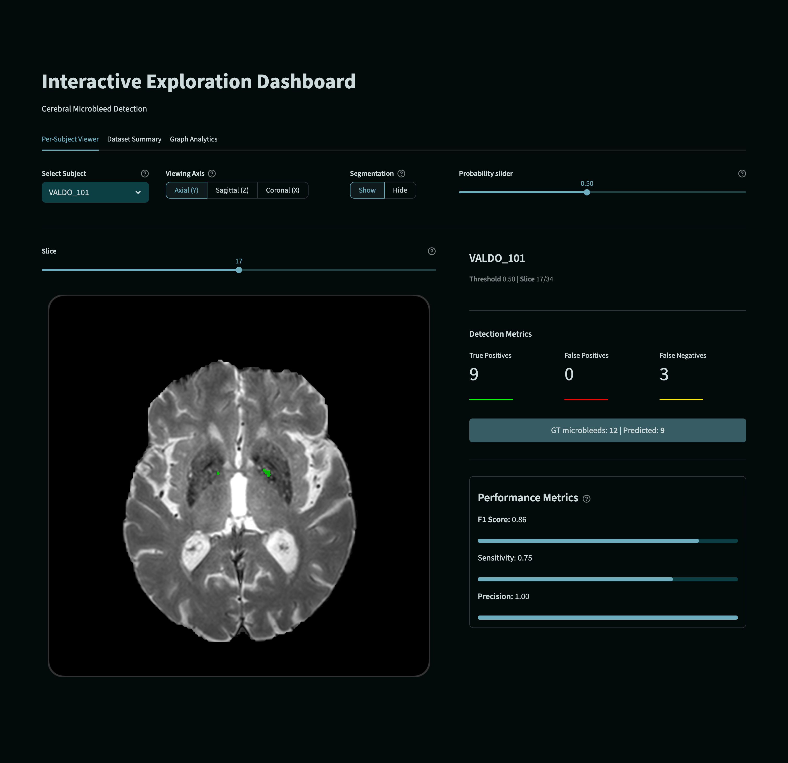
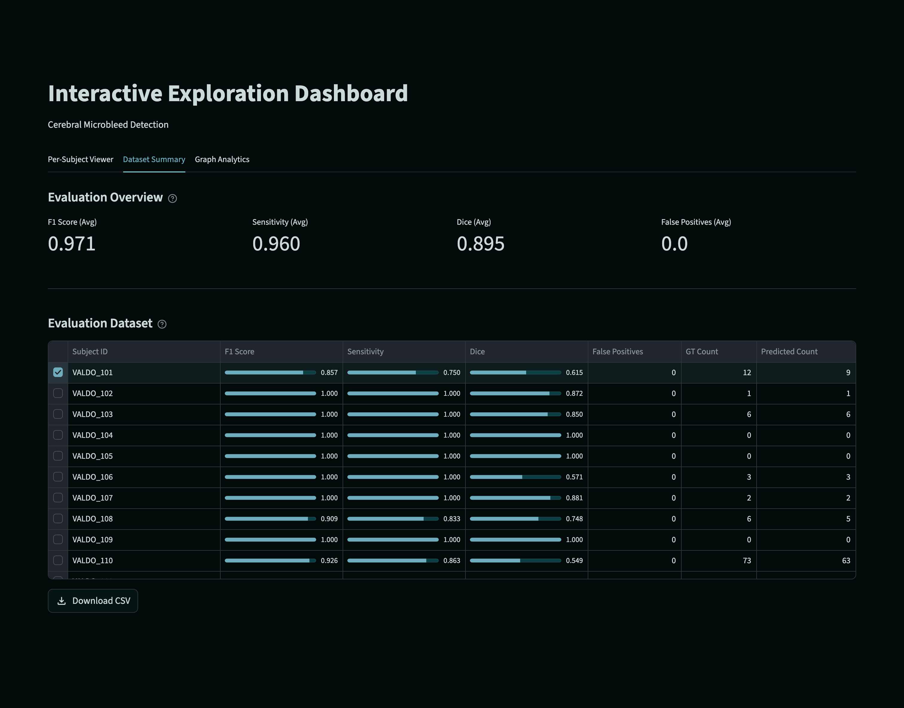
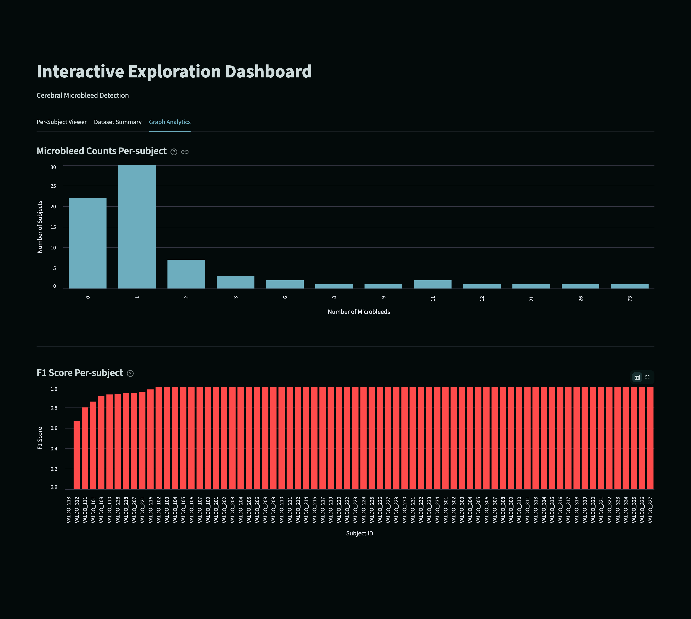

# Task 2: Interactive Exploration Dashboard

## Overview

The **Interactive Exploration Dashboard** is a web-based visualization tool built with Streamlit that enables interactive exploration and evaluation of the cerebral microbleed (CMB) detection model. It provides an intuitive interface for examining per-subject predictions, comparing model outputs with ground truth annotations, and analyzing dataset-wide performance patterns.

---

## Setup Instructions

### Prerequisites
- Python 3.11+
- Virtual environment activated (see main README)
- All dependencies installed from `requirements.txt`

### Running the Dashboard

1. **Ensure the virtual environment is activated:**
   ```bash
   source iapt_env/bin/activate  # macOS/Linux
   # or
   .\iapt_env\Scripts\activate  # Windows
   ```

2. **Run the Streamlit application:**
   ```bash
   streamlit run dashboard.py
   ```

3. **Access the dashboard:**
   - The application will open automatically in your default browser
   - URL: `http://localhost:8501`

### Data Requirements


#### Minimal Setup with Data Reorganization

To streamline setup, you only need to provide the raw nnU-Net outputs:
1. Place `nnUNet_raw` and `nnUNet_results` in the `data/` directory
2. Upon running the dashboard the code automatically extracts and reorganises the model outputs into the dashboard-compatible format  (`data/dashboard_data/`), so you don't need to manually populate the data folders above.

**NOTE: `The data/dashboard_data/` will only be populated as long as it is initially empty before running the UI.**

3. The dashboard_data will result in the following data output structures:

- `data/dashboard_data/volumes/` - T2S brain volumes
- `data/dashboard_data/labels/` - Ground truth microbleed labels
- `data/dashboard_data/predictions/` - Model predictions
- `data/dashboard_data/probabilities/` - Probability maps (.npz files)
- `data/dashboard_data/evaluation_results.csv` - Evaluation metrics

---

## Classification Algorithm

### Core Detection Mechanism

The dashboard employs a **connected-component analysis** approach for cerebral microbleed classification and evaluation:

#### 1. **Probability Thresholding**
The model outputs probability maps where each voxel receives a confidence score (0.0-1.0) representing the likelihood of being a microbleed. The user-adjustable threshold converts these probabilities into binary predictions:

$$\text{Binary Prediction} = \begin{cases} 1 & \text{if } P(x,y,z) > \tau \\ 0 & \text{otherwise} \end{cases}$$

where $\tau$ is the probability threshold.

#### 2. **Connected Component Labeling**
3D connected-component analysis identifies individual microbleed candidates. Two voxels are considered connected if they share a face, edge, or corner (26-connectivity in 3D):

```
Structure: 3×3×3 kernel with all neighbors
```

This generates:
- **Binary predictions:** Individual CMB instances from thresholded probabilities
- **Ground truth labels:** Annotated CMB instances from manual annotations

#### 3. **Classification Logic**

The algorithm classifies predictions into three categories by comparing predicted and ground truth connected components:

| Metric | Definition | Calculation |
|--------|------------|-------------|
| **True Positives (TP)** | Predicted CMBs with overlap to ground truth | Predicted components with any voxel overlap to GT components |
| **False Positives (FP)** | Predicted CMBs with no overlap to GT | $\text{FP} = N_{\text{pred}} - \|\text{overlapping predictions}\|$ |
| **False Negatives (FN)** | Missed ground truth CMBs | $\text{FN} = N_{\text{GT}} - \text{TP}$ |

#### 4. **Performance Metrics**

Three key metrics are computed for each subject and slice:

- **Sensitivity (Recall):** Fraction of true microbleeds detected
  $$\text{Sensitivity} = \frac{\text{TP}}{\text{TP} + \text{FN}}$$

- **Precision:** Fraction of predictions that are correct
  $$\text{Precision} = \frac{\text{TP}}{\text{TP} + \text{FP}}$$

- **F1 Score:** Harmonic mean balancing precision and sensitivity
  $$\text{F1} = \frac{2 \times \text{Precision} \times \text{Sensitivity}}{\text{Precision} + \text{Sensitivity}}$$

- **Dice Coefficient:** Spatial overlap between prediction and ground truth
  $$\text{Dice} = \frac{2 \times |A \cap B|}{|A| + |B|}$$

---

## Dashboard Features

### Tab 1: Per-Subject Viewer

**Interactive slice-by-slice visualization** of individual subjects with real-time performance metrics.



**Key Controls:**
- **Subject Selector:** Choose from 72 subjects (VALDO_101 to VALDO_327)
- **Viewing Axis:** Toggle between Axial (top-down), Sagittal (side), and Coronal (front) views
- **Segmentation Toggle:** Show/hide predicted microbleed overlays
- **Probability Threshold Slider:** Adjust confidence threshold (0.1-1.0) in real-time
- **Slice Navigator:** Browse through brain slices along the selected axis

**Visualization Elements:**
- **Green Overlay:** True Positives (correct predictions)
- **Red Overlay:** False Positives (incorrect predictions)
- **Yellow Overlay:** False Negatives (missed microbleeds)
- **Grayscale Background:** T2-weighted MRI brain volume

**Real-time Metrics Display:**
- Detection counts (TP, FP, FN)
- Ground truth and predicted microbleed counts
- Performance metrics (F1, Sensitivity, Precision) with progress bars
- Dynamic updates as threshold changes

---

### Tab 2: Dataset Summary

**Comprehensive dataset statistics** and aggregate performance analysis across all 72 subjects.



**Features:**
- **Interactive Table:** Sortable dataset with all evaluation metrics
- **Columns:** Subject ID, F1 Score, Sensitivity, Dice, False Positives, GT Count, Predicted Count
- **Download Option:** Export results as CSV for external analysis
- **Filtering & Sorting:** Interactive data exploration by any metric

---

### Tab 3: Graph Analytics

**Advanced statistical visualizations** of model performance across the dataset.



**Included Visualizations:**
- **Evaluation Metrics Box Plot:** Distribution of F1, Sensitivity, Precision across subjects
- **CMB Distribution:** Microbleed count distribution across subjects
- **Microbleed Volume Distribution:** Spatial distribution of CMB sizes
- **GT vs. Predicted Scatter:** Relationship between predicted and ground truth CMB counts

---

## Model Performance Patterns

## Interpreting Results

### Color-Coded Overlays

When "Segmentation" is toggled to **Show**, overlays appear on the brain scan:

- **Green (TP):** Correct detections—the model identified a real microbleed
- **Red (FP):** False alarms—the model detected something that isn't a microbleed (e.g., artifact, other lesions)
- **Yellow (FN):** Missed microbleeds—ground truth annotations not detected by the model

### Metrics Guide

| Metric | Interpretation | Clinical Significance |
|--------|-----------------|----------------------|
| **F1 Score** | Balanced accuracy metric (0-1) | Overall model reliability; higher is better |
| **Sensitivity** | Detection rate of true microbleeds | Important for diagnostic completeness |
| **Precision** | Proportion of correct predictions | Important for minimizing unnecessary workload |
| **Dice** | Spatial overlap of predictions | Relevant for follow-up studies and lesion tracking |

---

## Use Cases

1. **Model Evaluation:** Assess detection performance on held-out test subjects
2. **Threshold Optimization:** Find optimal probability threshold for clinical deployment
3. **Error Analysis:** Identify failure modes and edge cases (e.g., which subject types have more FP/FN)
4. **Data Quality:** Verify ground truth annotations and identify potential labeling errors
5. **Clinical Decision Support:** Enable radiologists to review AI predictions with confidence estimates

---

## Technical Details

### Data Format
- **Brain volumes:** NIfTI format (.nii.gz), T2-weighted images with orientation metadata
- **Labels:** Binary NIfTI files (1 = microbleed, 0 = background)
- **Predictions:** NIfTI files (continuous or binary)
- **Probability maps:** NumPy compressed archives (.npz) with shape (C, X, Y, Z) or (X, Y, Z)

### Voxel Space Handling
- Probability maps are automatically transposed and rotated to align with image space
- Aspect ratios are calculated from voxel spacings (zooms) to ensure accurate spatial visualization
- 26-connectivity is used for connected-component analysis to capture diagonal and corner neighbors

---